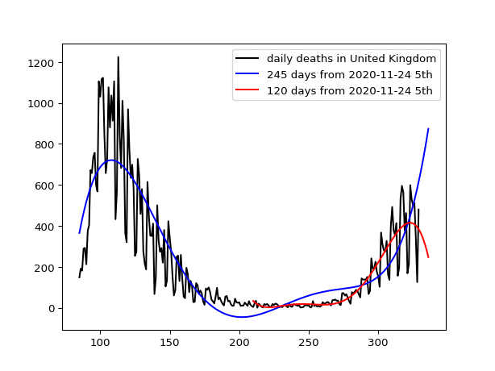

# uk

In order to run Python programs, see the following site for novice to install the necessary libraries: https://github.com/ytakefuji/python-novice

The predicted red points indicate the number of deaths in the US due to the COVID-19 on Nov.14, Nov.17 and Nov.21 respectively. X-axis is the xth day from Jan.22 2020 to Jan.15 2021. Y-axis depicts the number of daily deaths in UK due to the COVID-19.

The new_deaths.csv is downloaded from the following site:

https://raw.githubusercontent.com/owid/covid-19-data/master/public/data/jhu/new_deaths.csv

This site is stopped: 
https://covid.ourworldindata.org/data/ecdc/new_deaths.csv

