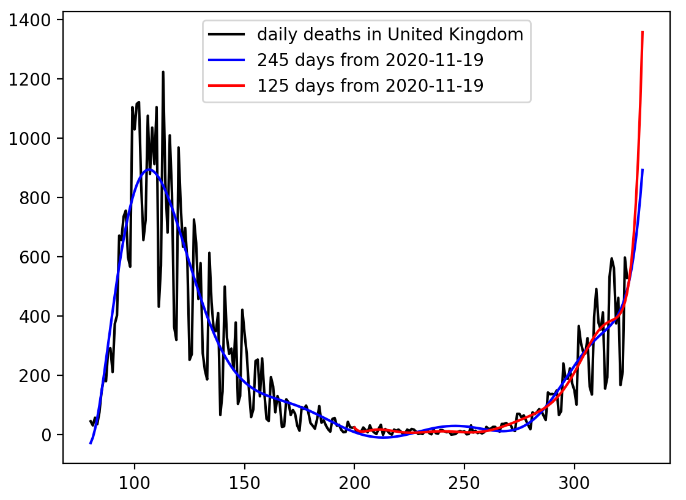

# uk

In order to run Python programs, see the following site for novice to install the necessary libraries: https://github.com/ytakefuji/python-novice

The predicted red points indicate the number of deaths in the US due to the COVID-19 on Nov.6, Nov.13 and Nov.20 respectively. X-axis is the xth day from Dec. 31 in 2019 to Oct. 30 in 2020. Y-axis depicts the number of daily deaths in the US due to the COVID-19.

The new_deaths.csv is downloaded from the following site: https://covid.ourworldindata.org/data/ecdc/new_deaths.csv

